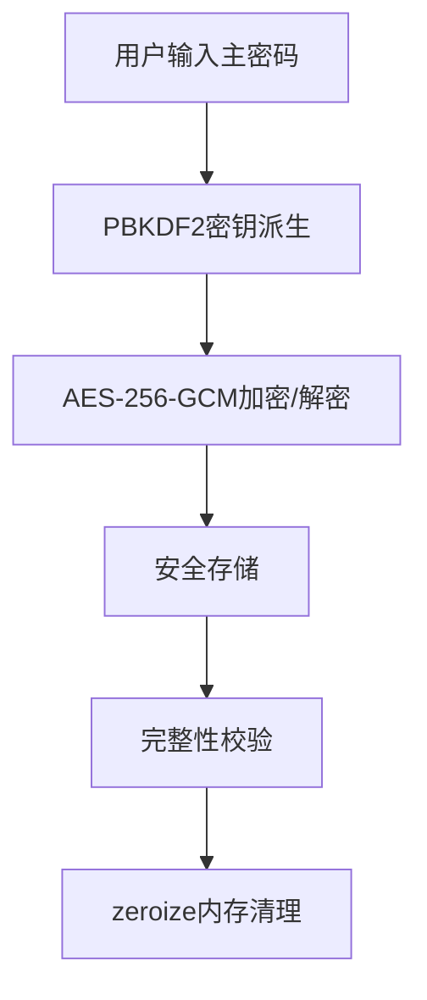

# 密码加密增强设计文档

## 1. 概述

### 1.1 背景
当前SSH密钥管理器应用的主密码加密机制存在严重的安全缺陷。系统使用简单的SHA-256哈希算法结合盐值进行密码处理，且加密数据使用XOR操作进行"加密"，这完全不符合现代安全标准。为了提升应用的安全性，需要采用工业标准的加密算法来替代当前较弱的加密实现。

### 1.2 目标
本设计旨在通过以下改进来增强密码加密安全性：
1. 使用PBKDF2作为密钥派生函数替代当前的SHA-256哈希
2. 使用AES-256-GCM作为对称加密算法替代当前的XOR"加密"
3. 集成zeroize库以安全处理内存中的敏感数据
4. 实现完整的单元测试覆盖

## 2. 架构设计

### 2.1 当前架构问题分析
当前实现存在以下安全问题：
- 密钥派生函数过于简单：仅使用SHA-256哈希，缺乏迭代次数和安全性
- 加密算法不安全：使用固定的XOR密钥(0x42)进行"加密"
- 缺乏认证加密：没有消息认证码(MAC)来验证数据完整性
- 内存安全处理缺失：未使用zeroize库清理敏感数据

### 2.2 改进后的架构


## 3. 核心组件设计

### 3.1 加密服务 (CryptoService)

#### 3.1.1 密钥派生函数改进
- 使用PBKDF2-HMAC-SHA256替代当前的SHA-256哈希
- 设置100,000次迭代以增强安全性
- 生成256位(32字节)输出密钥长度

#### 3.1.2 对称加密算法改进
- 使用AES-256-GCM替代XOR"加密"
- 提供认证加密，同时保证机密性和完整性
- 每次加密操作使用随机生成的96位nonce

#### 3.1.3 内存安全管理
- 集成zeroize库安全处理敏感数据
- 在使用后主动清零主密码和派生密钥
- 使用Zeroizing包装器确保敏感数据在作用域结束时自动清零

### 3.2 存储服务 (StorageService)
- 保持现有的存储结构和完整性校验机制
- 确保盐值和主密钥哈希作为元数据存储，不存储在加密数据本身中

## 4. API接口设计

### 4.1 密钥派生函数
```rust
// 使用PBKDF2派生密钥
pub fn derive_key(password: &str, salt: &[u8]) -> [u8; 32] {
    let mut key = [0u8; 32];
    pbkdf2::derive(
        pbkdf2::PBKDF2_HMAC_SHA256,
        NonZeroU32::new(100_000).unwrap(),
        salt,
        password.as_bytes(),
        &mut key,
    );
    key
}
```

### 4.2 加密接口
```rust
// AES-256-GCM加密
pub fn encrypt(&self, data: &[u8]) -> AppResult<EncryptedData> {
    let key = self.master_key.ok_or(AppError::Unknown("主密钥未设置".to_string()))?;
    let cipher = Aes256Gcm::new(&key.into());
    let nonce = Aes256Gcm::generate_nonce(&mut OsRng);
    
    let ciphertext = cipher
        .encrypt(&nonce, data)
        .map_err(AppError::CryptoError)?;
    
    Ok(EncryptedData {
        nonce: nonce.to_vec(),
        ciphertext,
    })
}
```

### 4.3 解密接口
```rust
// AES-256-GCM解密
pub fn decrypt(&self, encrypted: &EncryptedData) -> AppResult<Vec<u8>> {
    let key = self.master_key.ok_or(AppError::Unknown("主密钥未设置".to_string()))?;
    let cipher = Aes256Gcm::new(&key.into());
    let nonce = Nonce::from_slice(&encrypted.nonce);
    
    let plaintext = cipher
        .decrypt(nonce, encrypted.ciphertext.as_ref())
        .map_err(AppError::CryptoError)?;
    
    Ok(plaintext)
}
```

### 4.4 密码验证接口
```rust
// 验证密码
pub fn verify_password(&self, password: &str) -> bool {
    if let (Some(stored_hash), Some(salt)) = (&self.master_key_hash, &self.salt) {
        let derived_key = Self::derive_key(password, salt);
        // 使用加密安全的比较函数防止时序攻击
        use ring::constant_time;
        constant_time::verify_slices_are_equal(
            stored_hash.as_ref(),
            derived_key.as_ref()
        ).is_ok()
    } else {
        false
    }
}
```

### 4.5 主密码设置接口
```rust
// 设置主密码
pub fn set_master_key(&mut self, password: &str) -> AppResult<()> {
    let salt = Self::generate_salt();
    let derived_key = Self::derive_key(password, &salt);
    
    // 使用Zeroizing包装器确保密钥在作用域结束时自动清零
    self.master_key = Some(Zeroizing::new(derived_key));
    self.salt = Some(salt);
    
    // 存储派生密钥的哈希用于后续验证
    let key_hash = Self::hash_key(&derived_key, &salt);
    self.master_key_hash = Some(key_hash);
    
    Ok(())
}
```

## 5. 数据模型设计

### 5.1 EncryptedData结构
```rust
#[derive(Debug, serde::Serialize, serde::Deserialize)]
pub struct EncryptedData {
    pub nonce: Vec<u8>,      // 96位nonce用于AES-GCM
    pub ciphertext: Vec<u8>, // 加密后的密文
}
```

### 5.2 CryptoService结构
```rust
#[derive(ZeroizeOnDrop)] // 确保CryptoService实例被丢弃时自动清零敏感数据
pub struct CryptoService {
    master_key: Option<Zeroizing<[u8; 32]>>, // 使用zeroize安全处理
    salt: Option<[u8; 32]>,
}
```

## 6. 安全规范实现

### 6.1 密钥派生规范
- 推荐使用PBKDF2作为密钥派生函数
- 设置至少100,000次迭代以增强安全性
- 使用256位盐值防止彩虹表攻击

### 6.2 对称加密规范
- 使用AES-256-GCM作为对称加密算法
- 每次加密操作使用随机生成的96位nonce
- 确保数据的机密性和完整性

### 6.3 内存安全规范
- 使用zeroize库清除内存中的密码和密钥
- 确保敏感数据在使用后能被安全地清零

### 6.4 存储规范
- 确保salt和master_key_hash存储在顶层字段中
- 不在data映射中重复存储关键字段
- 使用检查master_key_hash字段判断初始化状态

## 7. 测试策略

### 7.1 单元测试
- 密钥派生函数测试：验证PBKDF2实现正确性
- 加密解密测试：验证AES-256-GCM加解密功能
- 内存安全测试：验证zeroize库正确清理敏感数据
- 边界条件测试：测试空数据、大数据等边界情况

### 7.2 集成测试
- 完整认证流程测试：从密码输入到数据解密的完整流程
- 数据持久化测试：验证加密数据正确存储和加载
- 安全性测试：验证无法通过简单手段破解加密数据

### 7.3 性能测试
- 加密解密性能测试：确保加密操作不会显著影响用户体验
- 内存使用测试：验证内存中敏感数据被正确清理

## 8. 部署与迁移

### 8.1 向后兼容性
- 新实现需要兼容现有存储格式
- 提供数据迁移工具以升级旧数据格式

### 8.2 部署步骤
1. 更新Cargo.toml添加新的加密库依赖
2. 实现新的加密服务
3. 更新存储服务以使用新的加密服务
4. 添加单元测试和集成测试
5. 验证向后兼容性
6. 文档更新

### 8.3 Cargo.toml依赖配置
```toml
[dependencies]
# 现有依赖保持不变...
ring = "0.17.14"
aes-gcm = "0.10"
zeroize = { version = "1.5", features = ["zeroize_derive"] }

# 添加新的加密库依赖
pbkdf2 = "0.12"

# 用于安全比较
constant-time = "0.1"
```

## 9. 风险评估与缓解措施

### 9.1 技术风险
- **风险**：新加密算法可能影响性能
- **缓解措施**：进行性能测试，优化实现

### 9.2 安全风险
- **风险**：实现错误可能导致安全漏洞
- **缓解措施**：进行全面代码审查和安全测试

### 9.3 兼容性风险
- **风险**：新实现可能不兼容旧数据格式
- **缓解措施**：提供数据迁移工具，确保向后兼容

## 10. 实施计划

### 10.1 阶段一：环境准备与依赖配置 (1天)
- 更新Cargo.toml添加必要的加密库依赖
- 配置开发环境确保所有依赖正确安装

### 10.2 阶段二：核心加密服务实现 (3天)
- 实现PBKDF2密钥派生函数
- 实现AES-256-GCM加密/解密功能
- 集成zeroize库处理内存中的敏感数据
- 编写单元测试验证功能正确性

### 10.3 阶段三：存储服务集成 (2天)
- 更新StorageService以使用新的加密服务
- 确保数据格式兼容性
- 实现数据迁移功能

### 10.4 阶段四：测试与验证 (2天)
- 进行全面的单元测试和集成测试
- 执行性能测试确保用户体验
- 进行安全审计和代码审查

### 10.5 阶段五：文档更新与部署 (1天)
- 更新相关文档
- 准备部署包
- 部署到测试环境进行最终验证

## 11. 注意事项

1. **安全性考虑**：所有密码和密钥处理必须在内存中安全进行，使用zeroize库确保敏感数据不会在内存中残留
2. **性能优化**：PBKDF2的100,000次迭代可能会影响性能，需要在安全性和用户体验之间找到平衡
3. **错误处理**：加密操作中的任何错误都应妥善处理，避免泄露敏感信息
4. **向后兼容**：新实现必须能够处理旧版本的数据格式，确保用户数据不会丢失
5. **测试覆盖**：必须编写全面的测试用例，包括边界条件和异常情况