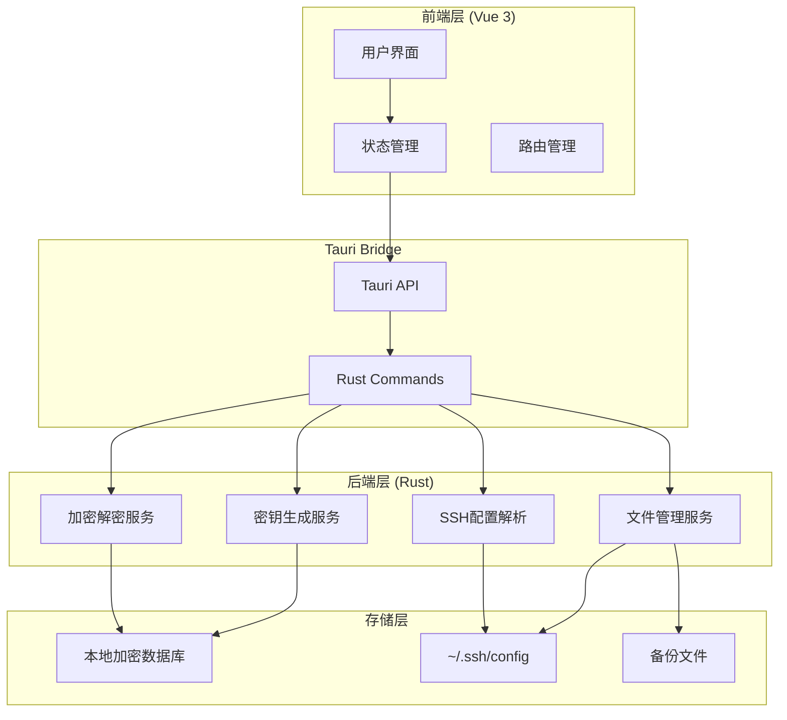
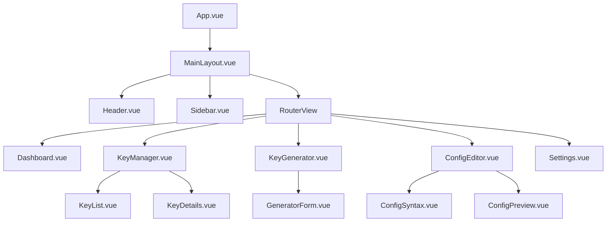
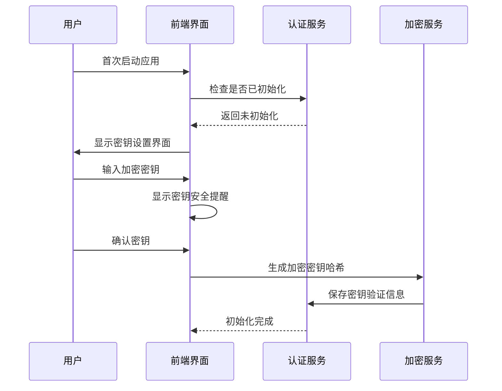
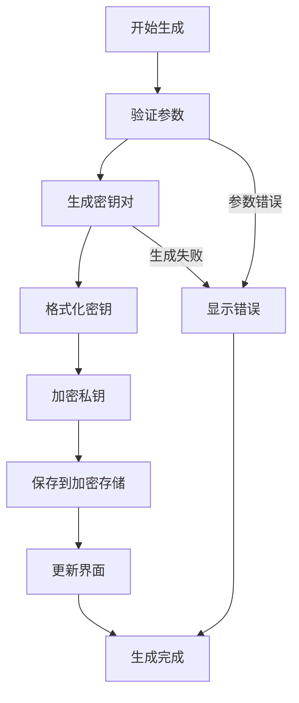
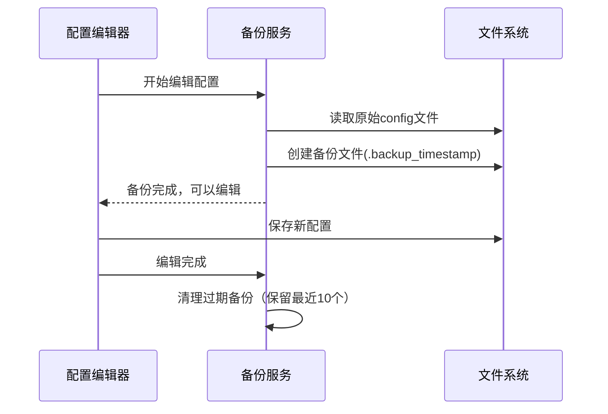
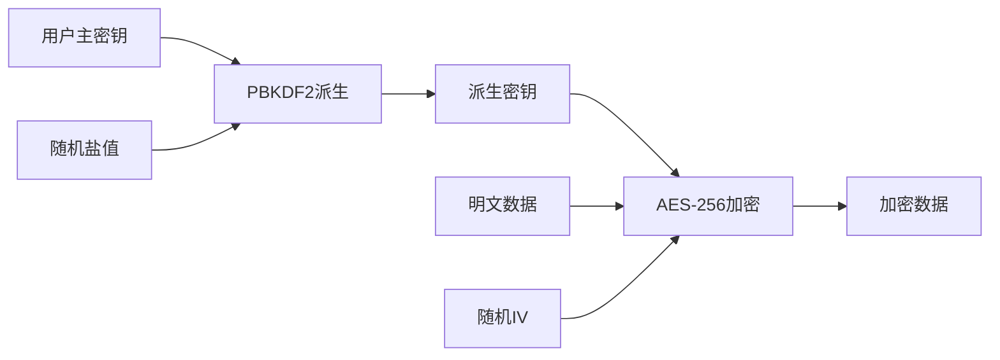
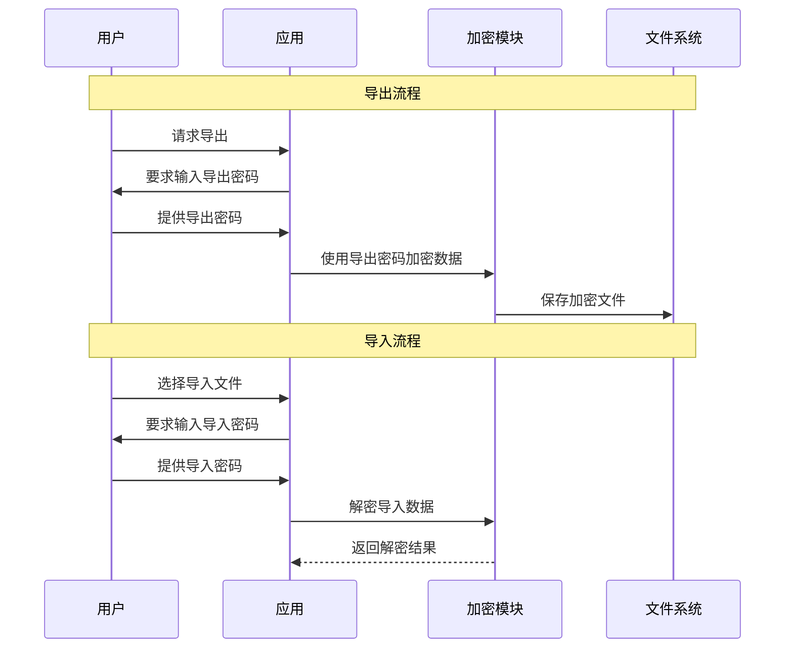

# SSH密钥管理工具开发文档

## 1. 项目概述

SSH密钥管理工具是一个基于Tauri框架的桌面应用程序，旨在解决开发者在使用Git和SSH时面临的密钥生成、管理和配置问题。

### 1.1 开发环境要求

#### 前置条件
- **Node.js**: >=18.0.0
- **Rust**: >=1.70.0
- **pnpm**: >=8.0.0 (推荐包管理器)

#### 操作系统支持
- Windows 10/11
- macOS 10.15+
- Ubuntu 18.04+

### 1.2 技术栈
- **前端**: Vue 3.3+ + TypeScript 5.0+
- **构建工具**: Vite 4.0+
- **UI框架**: TailwindCSS 3.0+
- **状态管理**: Pinia 2.0+
- **桌面框架**: Tauri 1.5+
- **后端语言**: Rust 1.70+
- **加密库**: ring, aes-gcm
- **SSH库**: ssh2, openssh-keys

### 1.3 项目结构
```
sshmanager/
├── src-tauri/          # Rust后端代码
│   ├── src/
│   │   ├── main.rs
│   │   ├── commands/   # Tauri命令
│   │   ├── services/   # 业务逻辑
│   │   └── utils/      # 工具函数
│   ├── Cargo.toml
│   └── tauri.conf.json
├── src/                # Vue前端代码
│   ├── components/     # Vue组件
│   ├── views/          # 页面视图
│   ├── stores/         # Pinia状态管理
│   ├── utils/          # 工具函数
│   └── main.ts
├── public/             # 静态资源
├── tests/              # 测试文件
├── docs/               # 项目文档
├── package.json
├── vite.config.ts
└── tailwind.config.js
```

## 2. 快速开始

### 2.1 开发环境搭建

#### 步骤1: 项目初始化
```bash
# 创建项目
pnpm create tauri-app sshmanager
cd sshmanager

# 安装依赖
pnpm install

# 添加必要依赖
pnpm add vue@^3.3.0 vue-router@^4.2.0 pinia@^2.1.0
pnpm add -D @vitejs/plugin-vue typescript tailwindcss

# 初始化 TailwindCSS
npx tailwindcss init -p
```

#### 步骤2: 配置文件设置

**vite.config.ts**
```typescript
import { defineConfig } from 'vite'
import vue from '@vitejs/plugin-vue'
import { resolve } from 'path'

export default defineConfig({
  plugins: [vue()],
  clearScreen: false,
  server: {
    port: 1420,
    strictPort: true,
  },
  envPrefix: ['VITE_', 'TAURI_'],
  resolve: {
    alias: {
      '@': resolve(__dirname, 'src'),
    },
  },
  build: {
    target: process.env.TAURI_PLATFORM == 'windows' ? 'chrome105' : 'safari13',
    minify: !process.env.TAURI_DEBUG ? 'esbuild' : false,
    sourcemap: !!process.env.TAURI_DEBUG,
  },
})
```

**tailwind.config.js**
```javascript
module.exports = {
  content: [
    './index.html',
    './src/**/*.{vue,js,ts,jsx,tsx}',
  ],
  theme: {
    extend: {
      colors: {
        primary: {
          50: '#eff6ff',
          500: '#3b82f6',
          600: '#2563eb',
          700: '#1d4ed8',
        },
      },
    },
  },
  plugins: [],
}
```

#### 步骤3: 运行开发环境
```bash
# 启动开发服务器
pnpm tauri dev

# 构建生产版本
pnpm tauri build
```

### 2.2 代码规范

#### ESLint 配置
```json
{
  "extends": [
    "@vue/typescript/recommended",
    "@vue/prettier",
    "@vue/prettier/@typescript-eslint"
  ],
  "rules": {
    "@typescript-eslint/no-unused-vars": "error",
    "@typescript-eslint/explicit-function-return-type": "warn",
    "vue/component-name-in-template-casing": ["error", "PascalCase"]
  }
}
```

#### Git提交规范
```
feat: 新功能
fix: 修复bug
docs: 文档更新
style: 代码格式调整
refactor: 重构
test: 测试相关
chore: 构建/工具链相关

示例: feat: 添加SSH密钥生成功能
```

## 3. 架构设计与实现

### 3.1 整体架构



### 3.2 前端架构实现

#### 3.2.1 Vue 3 项目结构
```typescript
// src/main.ts - 应用入口
import { createApp } from 'vue'
import { createPinia } from 'pinia'
import { createRouter, createWebHistory } from 'vue-router'
import App from './App.vue'
import routes from './routes'
import './style.css'

const app = createApp(App)
const pinia = createPinia()
const router = createRouter({
  history: createWebHistory(),
  routes,
})

app.use(pinia)
app.use(router)
app.mount('#app')
```

#### 3.2.2 组件开发指南

**基础组件结构**
```vue
<!-- src/components/BaseButton.vue -->
<template>
  <button
    :class="buttonClasses"
    :disabled="disabled"
    @click="$emit('click', $event)"
  >
    <slot></slot>
  </button>
</template>

<script setup lang="ts">
interface Props {
  variant?: 'primary' | 'secondary' | 'danger'
  size?: 'sm' | 'md' | 'lg'
  disabled?: boolean
}

const props = withDefaults(defineProps<Props>(), {
  variant: 'primary',
  size: 'md',
  disabled: false,
})

defineEmits<{
  click: [event: MouseEvent]
}>()

const buttonClasses = computed(() => {
  const base = 'inline-flex items-center justify-center rounded-md font-medium transition-colors'
  const variants = {
    primary: 'bg-primary-600 text-white hover:bg-primary-700',
    secondary: 'bg-gray-100 text-gray-900 hover:bg-gray-200',
    danger: 'bg-red-600 text-white hover:bg-red-700',
  }
  const sizes = {
    sm: 'px-3 py-1.5 text-sm',
    md: 'px-4 py-2 text-base',
    lg: 'px-6 py-3 text-lg',
  }
  
  return `${base} ${variants[props.variant]} ${sizes[props.size]} ${props.disabled ? 'opacity-50 cursor-not-allowed' : ''}`
})
</script>
```

**业务组件示例**
```vue
<!-- src/components/KeyCard.vue -->
<template>
  <div class="bg-white rounded-lg shadow-md p-6 border border-gray-200">
    <div class="flex items-center justify-between mb-4">
      <h3 class="text-lg font-semibold">{{ keyData.name }}</h3>
      <span class="text-sm text-gray-500">{{ keyData.type.toUpperCase() }}</span>
    </div>
    
    <div class="space-y-2 text-sm text-gray-600">
      <p><strong>指纹:</strong> {{ keyData.fingerprint }}</p>
      <p><strong>创建时间:</strong> {{ formatDate(keyData.createdAt) }}</p>
      <p><strong>密钥长度:</strong> {{ keyData.keySize }} bits</p>
    </div>
    
    <div class="flex gap-2 mt-4">
      <BaseButton size="sm" @click="copyPublicKey">复制公钥</BaseButton>
      <BaseButton size="sm" variant="secondary" @click="exportKey">导出</BaseButton>
      <BaseButton size="sm" variant="danger" @click="deleteKey">删除</BaseButton>
    </div>
  </div>
</template>

<script setup lang="ts">
import type { SshKeyPair } from '@/types'
import BaseButton from './BaseButton.vue'
import { formatDate } from '@/utils/date'
import { useKeyStore } from '@/stores/key'

interface Props {
  keyData: SshKeyPair
}

define Props<Props>()
const keyStore = useKeyStore()

const copyPublicKey = async () => {
  await navigator.clipboard.writeText(props.keyData.publicKey)
  // 显示成功提示
}

const exportKey = () => {
  keyStore.exportKey(props.keyData.id)
}

const deleteKey = () => {
  if (confirm('确定要删除这个密钥吗？')) {
    keyStore.deleteKey(props.keyData.id)
  }
}
</script>
```

#### 3.2.3 Pinia 状态管理实现

**认证状态管理**
```typescript
// src/stores/auth.ts
import { defineStore } from 'pinia'
import { ref, computed } from 'vue'
import { invoke } from '@tauri-apps/api/tauri'

export const useAuthStore = defineStore('auth', () => {
  const isAuthenticated = ref(false)
  const isInitialized = ref(false)
  const masterKeyHash = ref<string | null>(null)
  
  // 检查是否已初始化
  const checkInitialization = async (): Promise<boolean> => {
    try {
      const result = await invoke<boolean>('is_initialized')
      isInitialized.value = result
      return result
    } catch (error) {
      console.error('检查初始化状态失败:', error)
      return false
    }
  }
  
  // 初始化应用
  const initializeApp = async (masterKey: string): Promise<boolean> => {
    try {
      const result = await invoke<boolean>('initialize_app', { masterKey })
      if (result) {
        isInitialized.value = true
        isAuthenticated.value = true
      }
      return result
    } catch (error) {
      console.error('初始化应用失败:', error)
      return false
    }
  }
  
  // 用户登录
  const login = async (masterKey: string): Promise<boolean> => {
    try {
      const result = await invoke<boolean>('authenticate', { masterKey })
      isAuthenticated.value = result
      return result
    } catch (error) {
      console.error('登录失败:', error)
      return false
    }
  }
  
  // 用户登出
  const logout = () => {
    isAuthenticated.value = false
    masterKeyHash.value = null
  }
  
  return {
    isAuthenticated: readonly(isAuthenticated),
    isInitialized: readonly(isInitialized),
    checkInitialization,
    initializeApp,
    login,
    logout,
  }
})
```

**密钥管理状态**
```typescript
// src/stores/key.ts
import { defineStore } from 'pinia'
import { ref, computed } from 'vue'
import { invoke } from '@tauri-apps/api/tauri'
import type { SshKeyPair, KeyGenerationParams } from '@/types'

export const useKeyStore = defineStore('key', () => {
  const keys = ref<SshKeyPair[]>([])
  const selectedKeyId = ref<string | null>(null)
  const isLoading = ref(false)
  
  const selectedKey = computed(() => 
    keys.value.find(key => key.id === selectedKeyId.value)
  )
  
  // 加载所有密钥
  const loadKeys = async (): Promise<void> => {
    try {
      isLoading.value = true
      const result = await invoke<SshKeyPair[]>('get_all_keys')
      keys.value = result
    } catch (error) {
      console.error('加载密钥失败:', error)
    } finally {
      isLoading.value = false
    }
  }
  
  // 生成新密钥
  const generateKey = async (params: KeyGenerationParams): Promise<SshKeyPair | null> => {
    try {
      isLoading.value = true
      const newKey = await invoke<SshKeyPair>('generate_ssh_key', { params })
      keys.value.push(newKey)
      return newKey
    } catch (error) {
      console.error('生成密钥失败:', error)
      return null
    } finally {
      isLoading.value = false
    }
  }
  
  // 删除密钥
  const deleteKey = async (keyId: string): Promise<boolean> => {
    try {
      const result = await invoke<boolean>('delete_key', { keyId })
      if (result) {
        keys.value = keys.value.filter(key => key.id !== keyId)
        if (selectedKeyId.value === keyId) {
          selectedKeyId.value = null
        }
      }
      return result
    } catch (error) {
      console.error('删除密钥失败:', error)
      return false
    }
  }
  
  // 导出密钥
  const exportKey = async (keyId: string): Promise<boolean> => {
    try {
      return await invoke<boolean>('export_key', { keyId })
    } catch (error) {
      console.error('导出密钥失败:', error)
      return false
    }
  }
  
  return {
    keys: readonly(keys),
    selectedKey: readonly(selectedKey),
    isLoading: readonly(isLoading),
    loadKeys,
    generateKey,
    deleteKey,
    exportKey,
    setSelectedKey: (id: string | null) => { selectedKeyId.value = id },
  }
})
```

#### 3.2.4 路由配置
```typescript
// src/routes/index.ts
import type { RouteRecordRaw } from 'vue-router'
import Dashboard from '@/views/Dashboard.vue'
import KeyManager from '@/views/KeyManager.vue'
import KeyGenerator from '@/views/KeyGenerator.vue'
import ConfigEditor from '@/views/ConfigEditor.vue'
import Settings from '@/views/Settings.vue'
import Auth from '@/views/Auth.vue'

const routes: RouteRecordRaw[] = [
  {
    path: '/auth',
    name: 'Auth',
    component: Auth,
    meta: { requiresAuth: false }
  },
  {
    path: '/',
    name: 'Dashboard',
    component: Dashboard,
    meta: { requiresAuth: true }
  },
  {
    path: '/keys',
    name: 'KeyManager',
    component: KeyManager,
    meta: { requiresAuth: true }
  },
  {
    path: '/generator',
    name: 'KeyGenerator', 
    component: KeyGenerator,
    meta: { requiresAuth: true }
  },
  {
    path: '/config',
    name: 'ConfigEditor',
    component: ConfigEditor,
    meta: { requiresAuth: true }
  },
  {
    path: '/settings',
    name: 'Settings',
    component: Settings,
    meta: { requiresAuth: true }
  }
]

export default routes
```

**路由守卫**
```typescript
// src/router/guards.ts
import type { Router } from 'vue-router'
import { useAuthStore } from '@/stores/auth'

export function setupRouterGuards(router: Router) {
  router.beforeEach(async (to, from, next) => {
    const authStore = useAuthStore()
    
    // 检查是否需要认证
    if (to.meta.requiresAuth && !authStore.isAuthenticated) {
      // 检查是否已初始化
      const isInitialized = await authStore.checkInitialization()
      
      if (!isInitialized) {
        next({ name: 'Auth', query: { mode: 'setup' } })
      } else {
        next({ name: 'Auth', query: { mode: 'login' } })
      }
      return
    }
    
    // 已认证用户访问认证页面，重定向到主页
    if (to.name === 'Auth' && authStore.isAuthenticated) {
      next({ name: 'Dashboard' })
      return
    }
    
    next()
  })
}
```


### 3.3 Rust 后端实现

#### 3.3.1 项目依赖配置
```toml
# src-tauri/Cargo.toml
[package]
name = "sshmanager"
version = "0.1.0"
edition = "2021"

[dependencies]
tauri = { version = "1.5", features = ["api-all"] }
serde = { version = "1.0", features = ["derive"] }
serde_json = "1.0"
tokio = { version = "1.0", features = ["full"] }
ring = "0.17"
aes-gcm = "0.10"
rand = "0.8"
sha2 = "0.10"
base64 = "0.21"
openssh-keys = "0.6"
uuid = { version = "1.0", features = ["v4"] }
chrono = { version = "0.4", features = ["serde"] }
thiserror = "1.0"
anyhow = "1.0"
dirs = "5.0"

[build-dependencies]
tauri-build = { version = "1.5", features = [] }
```

#### 3.3.2 数据类型定义
```rust
// src-tauri/src/types.rs
use serde::{Deserialize, Serialize};
use chrono::{DateTime, Utc};

#[derive(Debug, Clone, Serialize, Deserialize)]
pub struct SshKeyPair {
    pub id: String,
    pub name: String,
    pub key_type: SshKeyType,
    pub key_size: u32,
    pub comment: String,
    pub public_key: String,
    pub private_key: String, // 加密存储
    pub fingerprint: String,
    pub created_at: DateTime<Utc>,
    pub last_used: Option<DateTime<Utc>>,
}

#[derive(Debug, Clone, Serialize, Deserialize)]
pub enum SshKeyType {
    Rsa,
    Ed25519,
    Ecdsa,
}

#[derive(Debug, Deserialize)]
pub struct KeyGenerationParams {
    pub name: String,
    pub key_type: SshKeyType,
    pub key_size: u32,
    pub comment: String,
}

#[derive(Debug, Serialize, Deserialize)]
pub struct AppConfig {
    pub theme: String,
    pub auto_backup: bool,
    pub backup_retention: u32,
    pub default_key_type: SshKeyType,
    pub default_key_size: u32,
    pub ssh_config_path: String,
}

#[derive(Debug, Serialize, Deserialize)]
pub struct EncryptedStorage {
    pub version: String,
    pub salt: Vec<u8>,
    pub iv: Vec<u8>,
    pub encrypted_data: Vec<u8>,
    pub checksum: String,
}
```

#### 3.3.3 加密服务实现
```rust
// src-tauri/src/services/crypto.rs
use aes_gcm::{
    aead::{Aead, KeyInit, OsRng},
    Aes256Gcm, Nonce,
};
use ring::pbkdf2;
use sha2::{Digest, Sha256};
use std::num::NonZeroU32;

pub struct CryptoService {
    master_key: Option<[u8; 32]>,
}

impl CryptoService {
    pub fn new() -> Self {
        Self { master_key: None }
    }
    
    // 从用户密码派生加密密钥
    pub fn derive_key(password: &str, salt: &[u8]) -> [u8; 32] {
        let mut key = [0u8; 32];
        pbkdf2::derive(
            pbkdf2::PBKDF2_HMAC_SHA256,
            NonZeroU32::new(100_000).unwrap(),
            salt,
            password.as_bytes(),
            &mut key,
        );
        key
    }
    
    // 生成密码哈希
    pub fn hash_password(password: &str, salt: &[u8]) -> String {
        let mut hasher = Sha256::new();
        hasher.update(password.as_bytes());
        hasher.update(salt);
        format!("{:x}", hasher.finalize())
    }
    
    // 设置主密钥
    pub fn set_master_key(&mut self, password: &str, salt: &[u8]) {
        self.master_key = Some(Self::derive_key(password, salt));
    }
    
    // 加密数据
    pub fn encrypt(&self, data: &[u8]) -> anyhow::Result<EncryptedData> {
        let key = self.master_key.ok_or_else(|| anyhow::anyhow!("主密钥未设置"))?;
        
        let cipher = Aes256Gcm::new(&key.into());
        let nonce_bytes = rand::random::<[u8; 12]>();
        let nonce = Nonce::from_slice(&nonce_bytes);
        
        let ciphertext = cipher
            .encrypt(nonce, data)
            .map_err(|e| anyhow::anyhow!("加密失败: {}", e))?;
        
        Ok(EncryptedData {
            nonce: nonce_bytes.to_vec(),
            ciphertext,
        })
    }
    
    // 解密数据
    pub fn decrypt(&self, encrypted: &EncryptedData) -> anyhow::Result<Vec<u8>> {
        let key = self.master_key.ok_or_else(|| anyhow::anyhow!("主密钥未设置"))?;
        
        let cipher = Aes256Gcm::new(&key.into());
        let nonce = Nonce::from_slice(&encrypted.nonce);
        
        cipher
            .decrypt(nonce, encrypted.ciphertext.as_ref())
            .map_err(|e| anyhow::anyhow!("解密失败: {}", e))
    }
}

#[derive(Debug, Serialize, Deserialize)]
pub struct EncryptedData {
    pub nonce: Vec<u8>,
    pub ciphertext: Vec<u8>,
}
```

#### 3.3.4 SSH密钥生成服务
```rust
// src-tauri/src/services/ssh_key.rs
use openssh_keys::{PrivateKey, PublicKey};
use uuid::Uuid;
use chrono::Utc;
use crate::types::{SshKeyPair, SshKeyType, KeyGenerationParams};

pub struct SshKeyService;

impl SshKeyService {
    // 生成SSH密钥对
    pub fn generate_key_pair(params: KeyGenerationParams) -> anyhow::Result<SshKeyPair> {
        let (private_key, public_key) = match params.key_type {
            SshKeyType::Rsa => Self::generate_rsa_key(params.key_size)?,
            SshKeyType::Ed25519 => Self::generate_ed25519_key()?,
            SshKeyType::Ecdsa => Self::generate_ecdsa_key(params.key_size)?,
        };
        
        let fingerprint = Self::calculate_fingerprint(&public_key)?;
        
        Ok(SshKeyPair {
            id: Uuid::new_v4().to_string(),
            name: params.name,
            key_type: params.key_type,
            key_size: params.key_size,
            comment: params.comment,
            public_key: public_key.to_string(),
            private_key: private_key.to_openssh(openssh_keys::Cipher::Null)?,
            fingerprint,
            created_at: Utc::now(),
            last_used: None,
        })
    }
    
    // 生成RSA密钥
    fn generate_rsa_key(bits: u32) -> anyhow::Result<(PrivateKey, PublicKey)> {
        let private_key = PrivateKey::generate_rsa(bits)?;
        let public_key = private_key.public_key();
        Ok((private_key, public_key))
    }
    
    // 生成Ed25519密钥
    fn generate_ed25519_key() -> anyhow::Result<(PrivateKey, PublicKey)> {
        let private_key = PrivateKey::generate_ed25519()?;
        let public_key = private_key.public_key();
        Ok((private_key, public_key))
    }
    
    // 生成ECDSA密钥
    fn generate_ecdsa_key(bits: u32) -> anyhow::Result<(PrivateKey, PublicKey)> {
        let curve = match bits {
            256 => openssh_keys::EcdsaCurve::P256,
            384 => openssh_keys::EcdsaCurve::P384,
            521 => openssh_keys::EcdsaCurve::P521,
            _ => return Err(anyhow::anyhow!("不支持的ECDSA曲线长度")),
        };
        
        let private_key = PrivateKey::generate_ecdsa(curve)?;
        let public_key = private_key.public_key();
        Ok((private_key, public_key))
    }
    
    // 计算密钥指纹
    fn calculate_fingerprint(public_key: &PublicKey) -> anyhow::Result<String> {
        let key_data = public_key.data();
        let mut hasher = Sha256::new();
        hasher.update(key_data);
        let hash = hasher.finalize();
        
        // 转换为SHA256指纹格式
        let fingerprint = hash
            .iter()
            .map(|b| format!("{:02x}", b))
            .collect::<Vec<_>>()
            .join(":");
            
        Ok(format!("SHA256:{}", base64::encode(&hash)))
    }
}
```

#### 3.3.5 Tauri 命令实现
```rust
// src-tauri/src/commands/mod.rs
use tauri::State;
use crate::services::{CryptoService, SshKeyService, ConfigService};
use crate::types::{SshKeyPair, KeyGenerationParams};
use std::sync::Mutex;

type CryptoState = State<'_, Mutex<CryptoService>>;

// 检查是否已初始化
#[tauri::command]
pub async fn is_initialized() -> Result<bool, String> {
    // 检查本地存储文件是否存在
    let app_dir = dirs::config_dir()
        .ok_or("无法获取配置目录")?;
    let storage_path = app_dir.join("sshmanager").join("storage.enc");
    Ok(storage_path.exists())
}

// 初始化应用
#[tauri::command]
pub async fn initialize_app(
    master_key: String,
    crypto_state: CryptoState<'_>,
) -> Result<bool, String> {
    let mut crypto = crypto_state.lock().map_err(|e| e.to_string())?;
    
    // 生成随机盐值
    let salt: [u8; 32] = rand::random();
    
    // 设置主密钥
    crypto.set_master_key(&master_key, &salt);
    
    // 创建初始存储
    let initial_data = serde_json::json!({
        "keys": [],
        "config": {
            "theme": "light",
            "auto_backup": true,
            "backup_retention": 10
        }
    });
    
    // 加密并保存
    let encrypted = crypto.encrypt(initial_data.to_string().as_bytes())
        .map_err(|e| e.to_string())?;
    
    // 保存到本地文件
    save_encrypted_storage(&encrypted, &salt).map_err(|e| e.to_string())?;
    
    Ok(true)
}

// 用户认证
#[tauri::command]
pub async fn authenticate(
    master_key: String,
    crypto_state: CryptoState<'_>,
) -> Result<bool, String> {
    let mut crypto = crypto_state.lock().map_err(|e| e.to_string())?;
    
    // 加载存储文件
    let (encrypted_data, salt) = load_encrypted_storage().map_err(|e| e.to_string())?;
    
    // 设置主密钥
    crypto.set_master_key(&master_key, &salt);
    
    // 尝试解密来验证密码
    match crypto.decrypt(&encrypted_data) {
        Ok(_) => Ok(true),
        Err(_) => Ok(false),
    }
}

// 生成SSH密钥
#[tauri::command]
pub async fn generate_ssh_key(
    params: KeyGenerationParams,
    crypto_state: CryptoState<'_>,
) -> Result<SshKeyPair, String> {
    // 生成密钥对
    let key_pair = SshKeyService::generate_key_pair(params)
        .map_err(|e| e.to_string())?;
    
    // 加载现有数据
    let mut data = load_and_decrypt_data(crypto_state).await?;
    
    // 添加新密钥
    data["keys"].as_array_mut()
        .ok_or("无效的数据格式")?;
        .push(serde_json::to_value(&key_pair).map_err(|e| e.to_string())?);
    
    // 保存数据
    save_encrypted_data(data, crypto_state).await?;
    
    Ok(key_pair)
}

// 获取所有密钥
#[tauri::command]
pub async fn get_all_keys(
    crypto_state: CryptoState<'_>,
) -> Result<Vec<SshKeyPair>, String> {
    let data = load_and_decrypt_data(crypto_state).await?;
    
    let keys: Vec<SshKeyPair> = data["keys"]
        .as_array()
        .ok_or("无效的数据格式")?
        .iter()
        .map(|v| serde_json::from_value(v.clone()))
        .collect::<Result<Vec<_>, _>>()
        .map_err(|e| e.to_string())?;
    
    Ok(keys)
}

// 删除密钥
#[tauri::command]
pub async fn delete_key(
    key_id: String,
    crypto_state: CryptoState<'_>,
) -> Result<bool, String> {
    let mut data = load_and_decrypt_data(crypto_state).await?;
    
    let keys = data["keys"].as_array_mut()
        .ok_or("无效的数据格式")?;
    
    // 查找并删除密钥
    let initial_len = keys.len();
    keys.retain(|key| {
        key["id"].as_str().unwrap_or("") != key_id
    });
    
    if keys.len() < initial_len {
        save_encrypted_data(data, crypto_state).await?;
        Ok(true)
    } else {
        Ok(false)
    }
}

// 辅助函数
async fn load_and_decrypt_data(
    crypto_state: CryptoState<'_>,
) -> Result<serde_json::Value, String> {
    let crypto = crypto_state.lock().map_err(|e| e.to_string())?;
    let (encrypted_data, _) = load_encrypted_storage().map_err(|e| e.to_string())?;
    
    let decrypted = crypto.decrypt(&encrypted_data).map_err(|e| e.to_string())?;
    let data_str = String::from_utf8(decrypted).map_err(|e| e.to_string())?;
    serde_json::from_str(&data_str).map_err(|e| e.to_string())
}

async fn save_encrypted_data(
    data: serde_json::Value,
    crypto_state: CryptoState<'_>,
) -> Result<(), String> {
    let crypto = crypto_state.lock().map_err(|e| e.to_string())?;
    let data_str = serde_json::to_string(&data).map_err(|e| e.to_string())?;
    
    let encrypted = crypto.encrypt(data_str.as_bytes()).map_err(|e| e.to_string())?;
    let salt: [u8; 32] = rand::random(); // 在实际实现中应使用现有盐值
    
    save_encrypted_storage(&encrypted, &salt).map_err(|e| e.to_string())
}
```

#### 3.3.6 主函数设置
```rust
// src-tauri/src/main.rs
#![cfg_attr(
    all(not(debug_assertions), target_os = "windows"),
    windows_subsystem = "windows"
)]

mod commands;
mod services;
mod types;

use commands::*;
use services::CryptoService;
use std::sync::Mutex;

fn main() {
    tauri::Builder::default()
        .manage(Mutex::new(CryptoService::new()))
        .invoke_handler(tauri::generate_handler![
            is_initialized,
            initialize_app,
            authenticate,
            generate_ssh_key,
            get_all_keys,
            delete_key,
            export_key,
            import_keys,
            get_ssh_config,
            update_ssh_config,
            backup_ssh_config,
        ])
        .run(tauri::generate_context!())
        .expect("应用启动失败");
}
```

## 4. 功能模块开发指南

### 4.1 用户认证模块

#### 4.1.1 认证界面实现
```vue
<!-- src/views/Auth.vue -->
<template>
  <div class="min-h-screen flex items-center justify-center bg-gray-50">
    <div class="max-w-md w-full space-y-8">
      <div class="text-center">
        <h2 class="text-3xl font-bold text-gray-900">
          {{ isSetupMode ? '初始化应用' : '解锁应用' }}
        </h2>
        <p class="mt-2 text-sm text-gray-600">
          {{ isSetupMode ? '设置主密码来保护您的SSH密钥' : '输入主密码来访问您的密钥' }}
        </p>
      </div>
      
      <form @submit.prevent="handleSubmit" class="space-y-6">
        <div>
          <label class="block text-sm font-medium text-gray-700">
            {{ isSetupMode ? '设置主密码' : '主密码' }}
          </label>
          <input
            v-model="password"
            type="password"
            required
            class="mt-1 block w-full px-3 py-2 border border-gray-300 rounded-md"
            :placeholder="isSetupMode ? '请设置一个强密码' : '请输入主密码'"
          />
        </div>
        
        <div v-if="isSetupMode">
          <label class="block text-sm font-medium text-gray-700">
            确认密码
          </label>
          <input
            v-model="confirmPassword"
            type="password"
            required
            class="mt-1 block w-full px-3 py-2 border border-gray-300 rounded-md"
            placeholder="请再次输入密码"
          />
        </div>
        
        <!-- 安全提示 -->
        <div v-if="isSetupMode" class="bg-yellow-50 border border-yellow-200 rounded-md p-4">
          <div class="flex">
            <div class="flex-shrink-0">
              <svg class="h-5 w-5 text-yellow-400" viewBox="0 0 20 20" fill="currentColor">
                <path fill-rule="evenodd" d="M8.257 3.099c.765-1.36 2.722-1.36 3.486 0l5.58 9.92c.75 1.334-.213 2.98-1.742 2.98H4.42c-1.53 0-2.493-1.646-1.743-2.98l5.58-9.92zM11 13a1 1 0 11-2 0 1 1 0 012 0zm-1-8a1 1 0 00-1 1v3a1 1 0 002 0V6a1 1 0 00-1-1z" clip-rule="evenodd" />
              </svg>
            </div>
            <div class="ml-3">
              <h3 class="text-sm font-medium text-yellow-800">重要提示</h3>
              <div class="mt-2 text-sm text-yellow-700">
                <ul class="list-disc list-inside space-y-1">
                  <li>请妥善保管您的主密码，一旦丢失无法找回</li>
                  <li>建议使用包含大小写字母、数字和特殊字符的强密码</li>
                  <li>密码长度建议不少于12位</li>
                </ul>
              </div>
            </div>
          </div>
        </div>
        
        <div v-if="error" class="text-red-600 text-sm">
          {{ error }}
        </div>
        
        <BaseButton 
          type="submit" 
          :disabled="isLoading || (isSetupMode && password !== confirmPassword)"
          class="w-full"
        >
          <span v-if="isLoading">{{ isSetupMode ? '初始化中...' : '登录中...' }}</span>
          <span v-else>{{ isSetupMode ? '初始化应用' : '解锁' }}</span>
        </BaseButton>
      </form>
    </div>
  </div>
</template>

<script setup lang="ts">
import { ref, computed, onMounted } from 'vue'
import { useRouter, useRoute } from 'vue-router'
import { useAuthStore } from '@/stores/auth'
import BaseButton from '@/components/BaseButton.vue'

const router = useRouter()
const route = useRoute()
const authStore = useAuthStore()

const password = ref('')
const confirmPassword = ref('')
const error = ref('')
const isLoading = ref(false)

const isSetupMode = computed(() => route.query.mode === 'setup')

onMounted(async () => {
  // 检查初始化状态
  const initialized = await authStore.checkInitialization()
  if (!initialized && route.query.mode !== 'setup') {
    router.push({ name: 'Auth', query: { mode: 'setup' } })
  }
})

const handleSubmit = async () => {
  if (isSetupMode.value && password.value !== confirmPassword.value) {
    error.value = '两次输入的密码不一致'
    return
  }
  
  if (password.value.length < 8) {
    error.value = '密码长度不能少于8位'
    return
  }
  
  error.value = ''
  isLoading.value = true
  
  try {
    let success = false
    
    if (isSetupMode.value) {
      success = await authStore.initializeApp(password.value)
    } else {
      success = await authStore.login(password.value)
    }
    
    if (success) {
      router.push({ name: 'Dashboard' })
    } else {
      error.value = isSetupMode.value ? '初始化失败' : '密码错误'
    }
  } catch (err) {
    error.value = '操作失败，请稍后重试'
  } finally {
    isLoading.value = false
  }
}
</script>
```


#### 3.1.2 安全认证机制
- 用户输入的主密钥通过PBKDF2进行密钥派生
- 使用SHA-256生成密钥哈希用于验证
- 每次启动需要输入主密钥进行解锁

### 4.2 SSH密钥生成模块

#### 4.2.1 密钥生成器界面
```vue
<!-- src/views/KeyGenerator.vue -->
<template>
  <div class="container mx-auto px-4 py-8">
    <div class="max-w-4xl mx-auto">
      <h1 class="text-2xl font-bold mb-8">生成SSH密钥</h1>
      
      <div class="grid grid-cols-1 lg:grid-cols-2 gap-8">
        <!-- 左侧：参数配置 -->
        <div class="bg-white rounded-lg shadow-md p-6">
          <h2 class="text-lg font-semibold mb-4">密钥参数</h2>
          
          <form @submit.prevent="generateKey" class="space-y-4">
            <!-- 密钥名称 -->
            <div>
              <label class="block text-sm font-medium text-gray-700 mb-1">
                密钥名称
              </label>
              <input
                v-model="keyParams.name"
                type="text"
                required
                class="w-full px-3 py-2 border border-gray-300 rounded-md"
                placeholder="例如：github-work"
              />
            </div>
            
            <!-- 密钥类型 -->
            <div>
              <label class="block text-sm font-medium text-gray-700 mb-1">
                密钥类型
              </label>
              <select 
                v-model="keyParams.key_type" 
                class="w-full px-3 py-2 border border-gray-300 rounded-md"
                @change="onKeyTypeChange"
              >
                <option value="rsa">RSA</option>
                <option value="ed25519">Ed25519 (推荐)</option>
                <option value="ecdsa">ECDSA</option>
              </select>
            </div>
            
            <!-- 密钥长度 -->
            <div v-if="keyParams.key_type !== 'ed25519'">
              <label class="block text-sm font-medium text-gray-700 mb-1">
                密钥长度 (bits)
              </label>
              <select 
                v-model.number="keyParams.key_size" 
                class="w-full px-3 py-2 border border-gray-300 rounded-md"
              >
                <option v-for="size in availableKeySizes" :key="size" :value="size">
                  {{ size }} bits
                </option>
              </select>
            </div>
            
            <!-- 注释 -->
            <div>
              <label class="block text-sm font-medium text-gray-700 mb-1">
                注释 (可选)
              </label>
              <input
                v-model="keyParams.comment"
                type="text"
                class="w-full px-3 py-2 border border-gray-300 rounded-md"
                placeholder="例如：user@hostname"
              />
            </div>
            
            <!-- 生成按钮 -->
            <BaseButton 
              type="submit" 
              :disabled="isGenerating || !keyParams.name"
              class="w-full"
            >
              <span v-if="isGenerating">生成中...</span>
              <span v-else">生成密钥</span>
            </BaseButton>
          </form>
          
          <!-- 进度条 -->
          <div v-if="isGenerating" class="mt-4">
            <div class="w-full bg-gray-200 rounded-full h-2">
              <div 
                class="bg-primary-600 h-2 rounded-full transition-all duration-300"
                :style="{ width: progress + '%' }"
              ></div>
            </div>
            <p class="text-sm text-gray-600 mt-2 text-center">
              {{ progressText }}
            </p>
          </div>
        </div>
        
        <!-- 右侧：生成结果 -->
        <div class="bg-white rounded-lg shadow-md p-6">
          <h2 class="text-lg font-semibold mb-4">生成结果</h2>
          
          <div v-if="!generatedKey" class="text-center text-gray-500 py-8">
            <svg class="mx-auto h-12 w-12 text-gray-400" fill="none" stroke="currentColor">
              <path stroke-linecap="round" stroke-linejoin="round" stroke-width="2" d="M15 7a2 2 0 012 2m0 0v6a2 2 0 01-2 2H9a2 2 0 01-2-2V9a2 2 0 012-2m6 0V7a2 2 0 00-2-2H9a2 2 0 00-2 2v2m6 0H9" />
            </svg>
            <p class="mt-2">请设置参数并生成密钥</p>
          </div>
          
          <!-- 密钥信息 -->
          <div v-else class="space-y-4">
            <div class="bg-gray-50 rounded-md p-4">
              <h3 class="font-medium text-gray-900 mb-2">密钥信息</h3>
              <div class="space-y-2 text-sm text-gray-600">
                <p><strong>名称:</strong> {{ generatedKey.name }}</p>
                <p><strong>类型:</strong> {{ generatedKey.key_type.toUpperCase() }}</p>
                <p><strong>长度:</strong> {{ generatedKey.key_size }} bits</p>
                <p><strong>指纹:</strong> {{ generatedKey.fingerprint }}</p>
              </div>
            </div>
            
            <!-- 公钥显示 -->
            <div>
              <label class="block text-sm font-medium text-gray-700 mb-1">
                公钥
              </label>
              <textarea 
                :value="generatedKey.public_key"
                readonly
                rows="3"
                class="w-full px-3 py-2 border border-gray-300 rounded-md bg-gray-50 text-sm font-mono"
              ></textarea>
              <BaseButton 
                size="sm" 
                variant="secondary" 
                class="mt-2"
                @click="copyToClipboard(generatedKey.public_key)"
              >
                复制公钥
              </BaseButton>
            </div>
            
            <!-- 操作按钮 -->
            <div class="flex gap-2 pt-4">
              <BaseButton @click="saveKey">保存密钥</BaseButton>
              <BaseButton variant="secondary" @click="exportKey">导出文件</BaseButton>
              <BaseButton variant="danger" @click="clearResult">清除</BaseButton>
            </div>
          </div>
        </div>
      </div>
    </div>
  </div>
</template>

<script setup lang="ts">
import { ref, computed, onMounted } from 'vue'
import { useKeyStore } from '@/stores/key'
import { useRouter } from 'vue-router'
import BaseButton from '@/components/BaseButton.vue'
import type { KeyGenerationParams, SshKeyPair, SshKeyType } from '@/types'

const keyStore = useKeyStore()
const router = useRouter()

const keyParams = ref<KeyGenerationParams>({
  name: '',
  key_type: 'ed25519' as SshKeyType,
  key_size: 256,
  comment: ''
})

const isGenerating = ref(false)
const progress = ref(0)
const progressText = ref('')
const generatedKey = ref<SshKeyPair | null>(null)

const availableKeySizes = computed(() => {
  switch (keyParams.value.key_type) {
    case 'rsa':
      return [2048, 4096]
    case 'ecdsa':
      return [256, 384, 521]
    default:
      return [256]
  }
})

const onKeyTypeChange = () => {
  keyParams.value.key_size = availableKeySizes.value[0]
}

const generateKey = async () => {
  isGenerating.value = true
  progress.value = 0
  progressText.value = '初始化生成器...'
  
  try {
    // 模拟进度
    const progressSteps = [
      { progress: 20, text: '生成随机数...' },
      { progress: 50, text: '计算密钥对...' },
      { progress: 80, text: '格式化密钥...' },
      { progress: 100, text: '生成完成' }
    ]
    
    for (const step of progressSteps) {
      await new Promise(resolve => setTimeout(resolve, 500))
      progress.value = step.progress
      progressText.value = step.text
    }
    
    const result = await keyStore.generateKey(keyParams.value)
    if (result) {
      generatedKey.value = result
    }
  } catch (error) {
    console.error('生成密钥失败:', error)
  } finally {
    isGenerating.value = false
  }
}

const copyToClipboard = async (text: string) => {
  try {
    await navigator.clipboard.writeText(text)
    // 显示成功提示
  } catch (error) {
    console.error('复制失败:', error)
  }
}

const saveKey = () => {
  // 密钥已经在生成时保存，这里只需要转到管理页面
  router.push({ name: 'KeyManager' })
}

const exportKey = async () => {
  if (generatedKey.value) {
    await keyStore.exportKey(generatedKey.value.id)
  }
}

const clearResult = () => {
  generatedKey.value = null
  progress.value = 0
  progressText.value = ''
}

onMounted(() => {
  // 设置默认注释
  keyParams.value.comment = `${window.navigator.userAgent.includes('Windows') ? 'user' : 'user'}@${window.location.hostname}`
})
</script>
```

#### 3.2.1 生成器界面设计
参考PuTTYgen软件界面，包含以下元素：

| 组件 | 功能 | 描述 |
|------|------|------|
| 密钥类型选择 | 选择算法 | RSA, ED25519, ECDSA选项 |
| 密钥长度设置 | 设置位数 | 2048, 4096位等选项 |
| 注释字段 | 添加标识 | 用户自定义密钥标识 |
| 生成按钮 | 触发生成 | 开始密钥生成过程 |
| 进度指示器 | 显示进度 | 生成过程可视化反馈 |
| 密钥预览区 | 显示结果 | 公钥和私钥内容展示 |

#### 3.2.2 密钥生成流程


### 3.3 密钥管理模块

#### 3.3.1 密钥列表界面
```vue
<!-- 密钥管理界面布局 -->
<template>
  <div class="key-manager">
    <div class="key-list">
      <!-- 密钥列表展示 -->
    </div>
    <div class="key-details">
      <!-- 密钥详情面板 -->
    </div>
  </div>
</template>
```

#### 3.3.2 密钥操作功能
- **查看密钥**: 显示公钥内容和指纹信息
- **复制公钥**: 一键复制到剪贴板
- **导出密钥**: 保存为标准格式文件
- **删除密钥**: 安全删除（含确认机制）
- **重命名密钥**: 修改密钥别名和注释

### 3.4 SSH配置编辑器

#### 3.4.1 配置文件结构解析
```rust
// SSH配置解析结构
struct SshConfig {
    hosts: Vec<HostConfig>,
    global_settings: HashMap<String, String>,
}

struct HostConfig {
    host_pattern: String,
    hostname: Option<String>,
    user: Option<String>,
    port: Option<u16>,
    identity_file: Option<String>,
    other_options: HashMap<String, String>,
}
```

#### 3.4.2 配置编辑功能
- **语法高亮**: 配置文件语法着色显示
- **智能补全**: Host配置项自动完成
- **实时验证**: 配置语法错误检测
- **可视化编辑**: 表单化的配置编辑界面
- **预览模式**: 编辑前后对比视图

#### 3.4.3 自动备份机制


## 4. 数据模型设计

### 4.1 密钥数据结构
```typescript
interface SshKeyPair {
  id: string;
  name: string;
  type: 'rsa' | 'ed25519' | 'ecdsa';
  keySize: number;
  comment: string;
  publicKey: string;
  privateKey: string; // 加密存储
  fingerprint: string;
  createdAt: Date;
  lastUsed?: Date;
}
```

### 4.2 配置数据结构
```typescript
interface AppConfig {
  theme: 'light' | 'dark';
  autoBackup: boolean;
  backupRetention: number; // 保留备份数量
  defaultKeyType: string;
  defaultKeySize: number;
  sshConfigPath: string;
}
```

### 4.3 加密存储结构
```rust
struct EncryptedStorage {
    version: String,
    salt: [u8; 32],
    iv: [u8; 16],
    encrypted_data: Vec<u8>,
    checksum: String,
}
```

## 5. 安全设计

### 5.1 数据加密流程


### 5.2 安全措施
- **密钥派生**: 使用PBKDF2-HMAC-SHA256，迭代100,000次
- **数据完整性**: 使用HMAC-SHA256验证数据完整性
- **内存安全**: 敏感数据使用后立即清零
- **文件权限**: 确保配置文件和密钥文件权限正确

### 5.3 导入导出安全


## 6. 用户界面设计

### 6.1 主界面布局
```
┌─────────────────────────────────────────┐
│ SSH Key Manager          [_] [□] [×]    │
├─────────────────────────────────────────┤
│ 🔑 密钥管理  │                          │
│ ⚙️ 生成密钥   │     主内容区域            │
│ 📝 配置编辑  │                          │
│ 🔧 设置     │                          │
│             │                          │
├─────────────┼──────────────────────────┤
│             │ 状态栏: 已加载3个密钥     │
└─────────────────────────────────────────┘
```

### 6.2 TailwindCSS样式策略
- **色彩主题**: 支持明暗两种主题
- **响应式设计**: 适配不同窗口大小
- **组件复用**: 创建可复用的UI组件库
- **无障碍性**: 遵循WCAG 2.1标准

### 6.3 主要页面设计

#### 6.3.1 密钥生成页面
- 左侧：参数配置面板
- 右侧：生成结果展示
- 底部：操作按钮区域

#### 6.3.2 密钥管理页面
- 左侧：密钥列表（卡片式展示）
- 右侧：选中密钥的详细信息
- 顶部：搜索和筛选工具栏

#### 6.3.3 配置编辑页面
- 上部：工具栏（保存、重置、预览）
- 中部：代码编辑器（语法高亮）
- 下部：配置验证结果

## 7. 测试策略

### 7.1 单元测试
- **前端测试**: 使用Vitest进行Vue组件测试
- **后端测试**: 使用Rust内置测试框架
- **加密模块测试**: 重点测试加解密功能正确性

### 7.2 集成测试
- **Tauri命令测试**: 前后端通信接口测试
- **文件操作测试**: SSH配置文件读写测试
- **端到端测试**: 使用Playwright进行完整流程测试

### 7.3 安全测试
- **加密强度测试**: 验证AES-256加密实现
- **密钥管理测试**: 测试密钥生成和存储安全性
- **渗透测试**: 模拟攻击场景验证安全措施