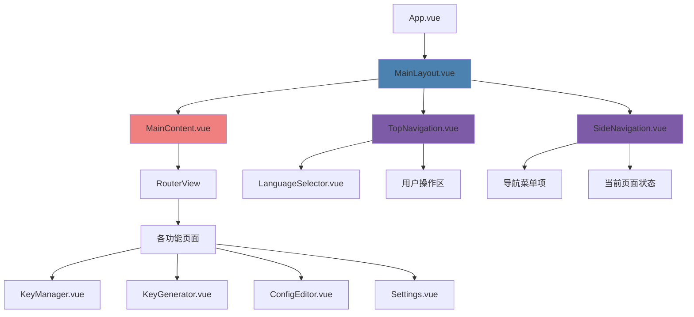
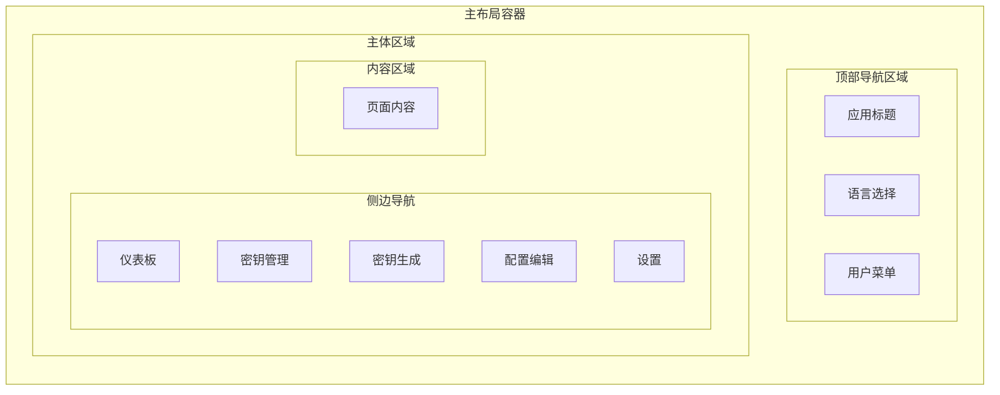

# SSH Manager 统一页面布局设计

## 概述

本设计旨在重构SSH Manager应用的页面布局结构，将仪表板的导航系统提取为公共组件，实现所有页面的布局统一。通过建立一致的导航体验，提升用户界面的连贯性和操作效率。

## 现状分析

### 当前布局问题

当前应用存在以下布局不一致问题：

1. **导航分离**：仪表板拥有完整的左侧菜单和顶部导航栏，其他页面只有独立的顶部导航栏
2. **重复元素**：每个页面都实现了相似的顶部导航栏，存在代码重复
3. **导航体验不一致**：用户在不同页面间切换时，布局变化较大，影响使用体验
4. **维护成本高**：导航相关的修改需要在多个文件中同步更新

### 仪表板布局优势

仪表板(`Dashboard.vue`)采用了现代化的布局设计：

- **统一顶部导航**：包含应用标题、语言选择器和登出按钮
- **侧边栏菜单**：提供清晰的功能导航，支持当前页面高亮
- **主内容区**：独立的内容展示区域
- **现代视觉效果**：使用玻璃态效果、渐变和动画

## 架构设计

### 组件架构



### 布局层次结构



## 组件设计

### 1. MainLayout.vue (主布局组件)

**职责**：
- 提供统一的页面布局框架
- 协调顶部导航和侧边栏的交互
- 管理布局状态（如侧边栏收缩）

**核心特性**：
- 响应式布局设计
- 支持侧边栏收缩/展开
- 统一的背景和视觉效果
- 路由变化时的过渡动画

### 2. TopNavigation.vue (顶部导航组件)

**职责**：
- 显示应用标题和图标
- 集成语言选择器
- 提供用户操作入口（登出）

**设计特点**：
- 玻璃态效果和阴影
- 固定在页面顶部
- 与侧边栏配色协调

### 3. SideNavigation.vue (侧边导航组件)

**职责**：
- 展示功能模块导航菜单
- 高亮当前激活页面
- 支持图标和文字标签

**交互设计**：
- 悬停效果和点击反馈
- 渐变背景和发光效果
- 平滑的过渡动画

### 4. MainContent.vue (主内容容器)

**职责**：
- 为页面内容提供统一容器
- 处理内容区域的滚动和布局
- 支持页面切换动画

## 实现方案

### 路由结构调整

```typescript
// 新的路由配置结构
const routes: RouteRecordRaw[] = [
  {
    path: '/auth',
    name: 'Auth',
    component: Auth,
    meta: { requiresAuth: false, layout: 'auth' }
  },
  {
    path: '/',
    component: MainLayout,  // 使用主布局作为容器
    meta: { requiresAuth: true },
    children: [
      {
        path: '',
        name: 'Dashboard',
        component: DashboardContent,  // 仅内容部分
      },
      {
        path: 'keys',
        name: 'KeyManager',
        component: KeyManagerContent,
      },
      {
        path: 'generator',
        name: 'KeyGenerator',
        component: KeyGeneratorContent,
      },
      {
        path: 'config',
        name: 'ConfigEditor',
        component: ConfigEditorContent,
      },
      {
        path: 'settings',
        name: 'Settings',
        component: SettingsContent,
      }
    ]
  }
]
```

### 页面内容重构策略

1. **移除顶部导航**：删除各页面中的独立导航栏实现
2. **精简容器结构**：移除页面级别的`min-h-screen`等全局容器样式
3. **保留核心功能**：保持页面的业务逻辑和交互功能不变
4. **统一内容边距**：采用一致的内容间距和布局规范

### 导航菜单配置

```typescript
// 导航菜单数据结构
interface NavigationItem {
  name: string
  label: ComputedRef<string>
  href: string
  icon: Component
  badge?: ComputedRef<string | number>
}

// 导航配置
const navigationItems: NavigationItem[] = [
  {
    name: 'Dashboard',
    label: computed(() => t('nav.dashboard')),
    href: '/',
    icon: HomeIcon
  },
  {
    name: 'KeyManager',
    label: computed(() => t('nav.keyManager')),
    href: '/keys',
    icon: KeyIcon,
    badge: computed(() => keyStore.keys.length)
  },
  {
    name: 'KeyGenerator',
    label: computed(() => t('nav.keyGenerator')),
    href: '/generator',
    icon: PlusIcon
  },
  {
    name: 'ConfigEditor',
    label: computed(() => t('nav.configEditor')),
    href: '/config',
    icon: DocumentTextIcon
  },
  {
    name: 'Settings',
    label: computed(() => t('nav.settings')),
    href: '/settings',
    icon: Cog6ToothIcon
  }
]
```

## 样式设计规范

### 布局尺寸

- **侧边栏宽度**：256px（w-64）
- **顶部导航高度**：64px（h-16）
- **内容区域内边距**：32px（p-8）
- **响应式断点**：遵循Tailwind CSS标准

### 视觉效果

- **玻璃态效果**：`backdrop-blur-md bg-white/90`
- **阴影效果**：`shadow-lg shadow-black/5`
- **渐变背景**：保持现有的科技感渐变
- **过渡动画**：`transition-all duration-300`

### 颜色方案

- **导航背景**：白色半透明玻璃态
- **激活状态**：主色调渐变（primary-500 to primary-600）
- **悬停状态**：白色60%透明度
- **文字颜色**：tech-600 / tech-900

## 状态管理

### 布局状态

```typescript
interface LayoutState {
  sidebarCollapsed: boolean
  currentRoute: string
  navigationItems: NavigationItem[]
}
```

### 响应式行为

- **桌面端**：侧边栏默认展开，支持手动收缩
- **平板端**：侧边栏默认收缩为图标模式
- **移动端**：侧边栏转为覆盖式抽屉，默认隐藏

## 迁移计划

### 阶段一：组件开发
1. 创建MainLayout.vue布局组件
2. 提取TopNavigation.vue顶部导航组件
3. 提取SideNavigation.vue侧边导航组件
4. 开发MainContent.vue内容容器组件

### 阶段二：路由重构
1. 修改路由配置，引入嵌套路由结构
2. 更新App.vue，集成MainLayout组件
3. 配置路由守卫和页面过渡动画

### 阶段三：页面重构
1. 重构各页面组件，移除独立导航栏
2. 精简页面容器结构，专注内容展示
3. 统一内容区域的样式和布局

### 阶段四：测试优化
1. 功能测试：确保所有页面导航正常
2. 响应式测试：验证不同屏幕尺寸下的表现
3. 用户体验优化：调整动画和交互细节

## 技术考量

### 性能优化

- **组件缓存**：使用Vue的keep-alive缓存页面组件
- **懒加载**：保持路由组件的懒加载机制
- **虚拟滚动**：大量内容时考虑虚拟滚动优化

### 可访问性

- **键盘导航**：支持Tab键和方向键导航
- **屏幕阅读器**：提供适当的ARIA标签
- **颜色对比度**：确保文字和背景的对比度符合WCAG标准

### 国际化支持

- **文本提取**：所有导航文本支持i18n
- **RTL支持**：为右到左语言预留布局调整空间
- **动态语言切换**：语言变更时平滑更新界面

## 预期效果

### 用户体验提升

1. **一致的导航体验**：用户在任何页面都能看到统一的导航结构
2. **更高的操作效率**：快速的页面切换和清晰的功能入口
3. **更好的空间利用**：侧边栏常驻，减少页面跳转的视觉干扰

### 开发效率提升

1. **代码复用**：导航逻辑集中管理，减少重复代码
2. **维护便利**：导航相关修改只需在一处进行
3. **扩展性强**：新增功能页面时，自动继承统一布局

### 技术架构优化

1. **组件化程度提高**：清晰的组件职责划分
2. **路由结构优化**：嵌套路由提供更好的页面组织
3. **状态管理简化**：统一的布局状态管理