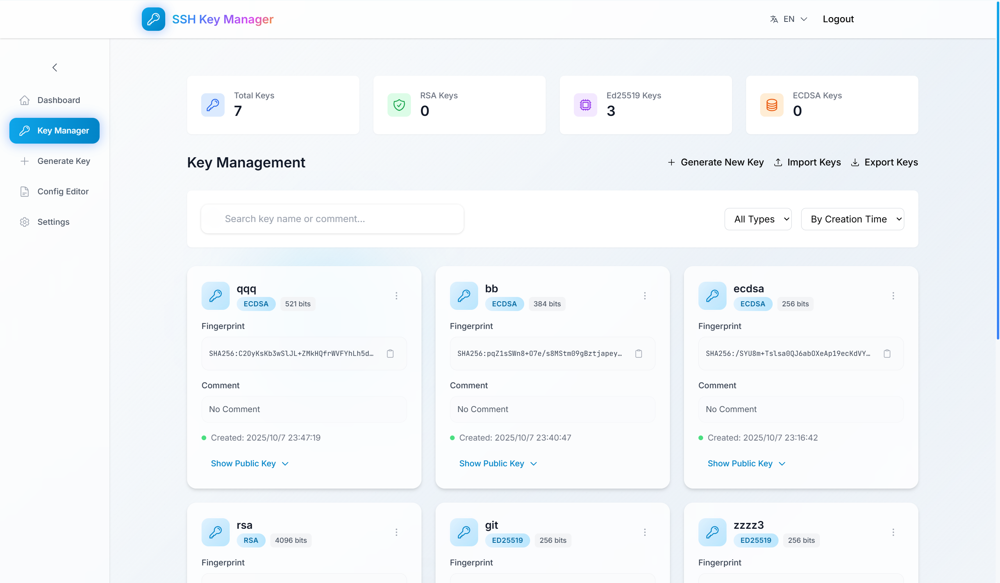
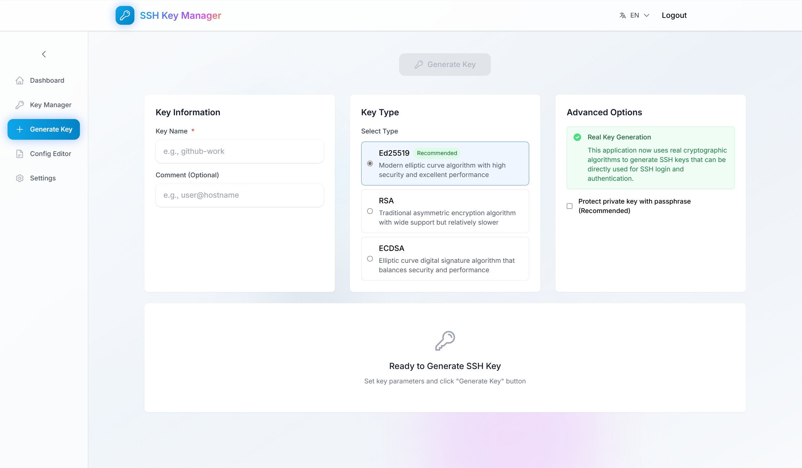
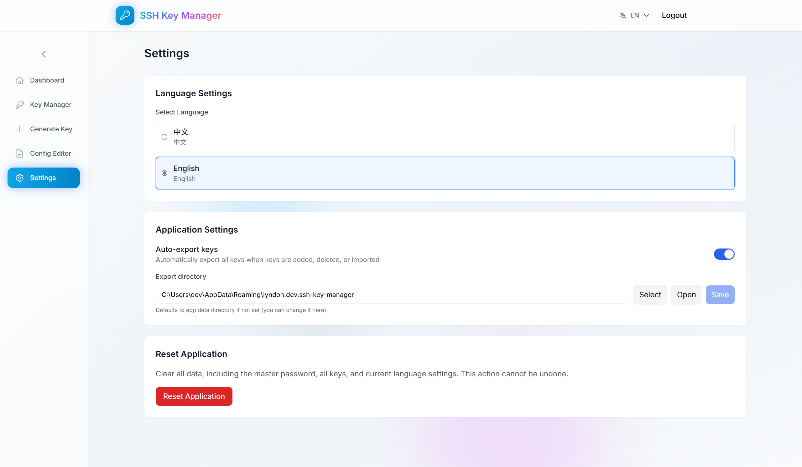

## SSH Key Manager

English | [中文说明](./README_cn.md)

### Overview
SSH Key Manager is a cross‑platform desktop application built with Tauri 2 and Vue 3 for generating and managing SSH keys, and editing OpenSSH configuration with a form + raw editor workflow.

### Features
- **Key generation**: Ed25519, RSA (2048/4096), ECDSA (256/384/521), optional passphrase
- **Key management**: list, search, edit name/comment, delete
- **Import/Export**: JSON import/export; export selected keys to `~/.ssh`
- **SSH config editor**: host list, common options, advanced options, live preview, raw editor, save to `~/.ssh/config`
- **Internationalization**: English/Chinese UI
- **Tech stack**: Tauri 2, Vue 3, Pinia, Vue Router, Tailwind CSS, Heroicons, Vitest

### Prerequisites
- Node.js 20+
- pnpm 8+
- Rust stable toolchain
- Tauri system prerequisites per OS (MSVC/WebView2 on Windows, Xcode on macOS, required libs on Linux)
  - See: [Tauri Prerequisites](https://tauri.app/v2/guides/getting-started/prerequisites)

### Quick Start
```bash
pnpm i

# Desktop (Tauri) development
pnpm tauri dev

# Web dev server (optional)
pnpm dev
```

### Build
- **Desktop app (Tauri)**
  ```bash
  pnpm tauri build
  ```
- **Web build**
  ```bash
  pnpm build
  pnpm preview # optional
  ```

### Test
```bash
pnpm test            # watch
pnpm test:ui         # Vitest UI
pnpm test:run        # single run
pnpm test:coverage   # HTML/LCOV coverage -> coverage/index.html
```

### Scripts (from package.json)
- `dev`: Vite dev server
- `build`: Type-check then Vite build
- `preview`: Preview built assets
- `tauri`: Run Tauri CLI (dev/build via prompts)
- `test*`: Vitest commands

### Project Structure
```text
src/                  # Vue 3 app
  views/
    KeyGenerator.vue  # generate keys
    KeyManager.vue    # manage/search/edit/import/export keys
    ConfigEditor.vue  # edit OpenSSH config (form + raw)
  stores/
    key.ts            # key store (Pinia)
  utils/
    sshOptions.ts     # common SSH option specs/helpers
src-tauri/            # Tauri 2 Rust backend, config, icons
tests/                # Vitest unit tests
```

### Screenshots
<p align="center">
  
</p>
<p align="center">
  
</p>
<p align="center">
  
</p>
<p align="center">
  
</p>
<p align="center">
  
</p>
<p align="center">
  
</p>

### Configuration Notes
- Dev server: `http://127.0.0.1:1420` (Vite), set via `vite.config.ts` and `src-tauri/tauri.conf.json`
- HMR over `ws://127.0.0.1:1421` when `TAURI_DEV_HOST` is set (Windows script does this automatically)

### Security
- Keys and config are handled locally. Be careful when exporting keys to `~/.ssh`; protect private keys with appropriate permissions and passphrases when required.

### License
This repository does not declare a license yet.


