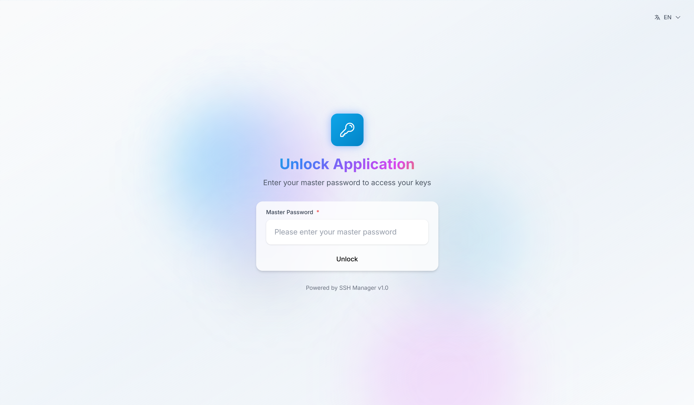
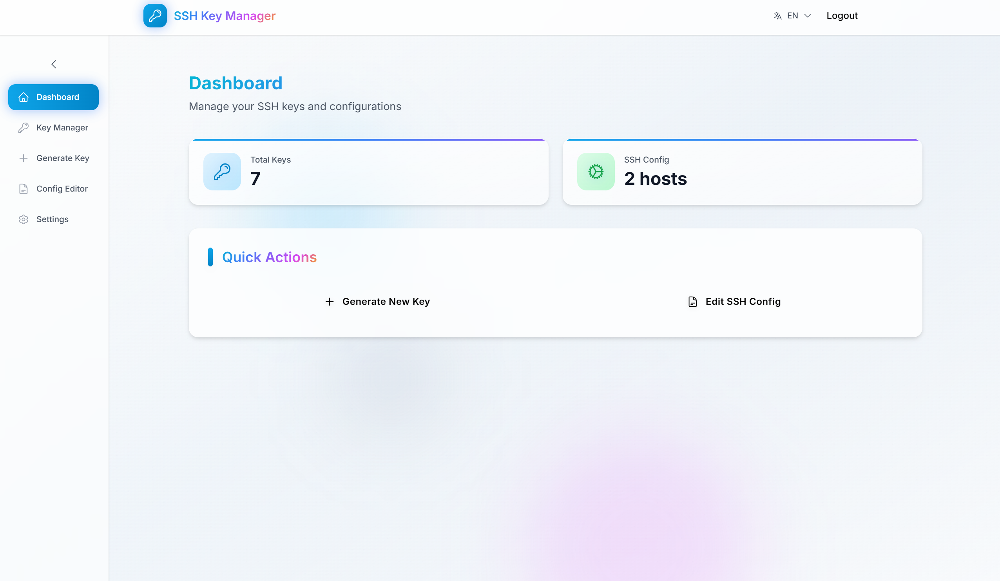
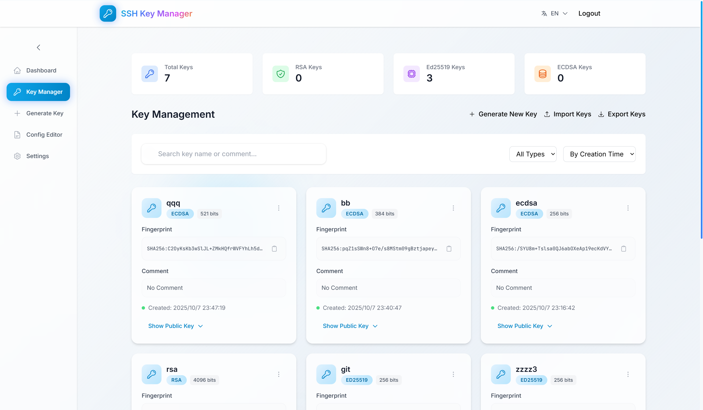
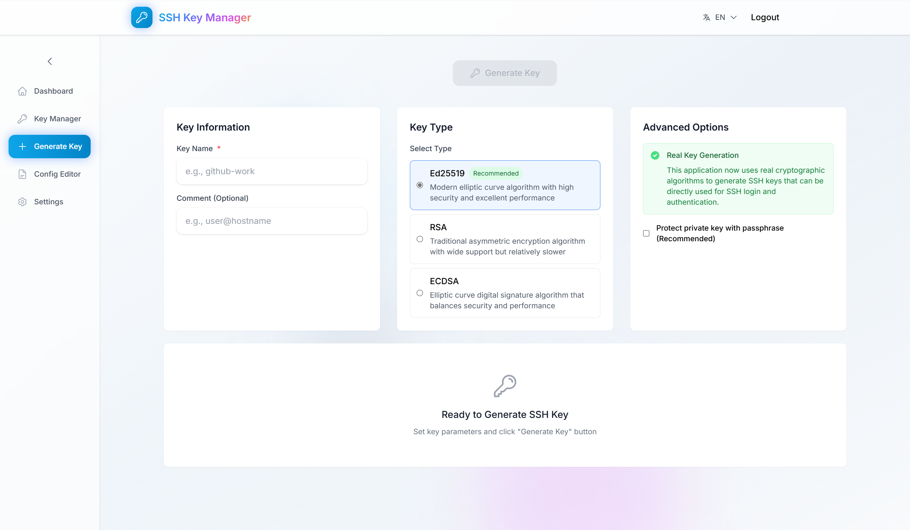
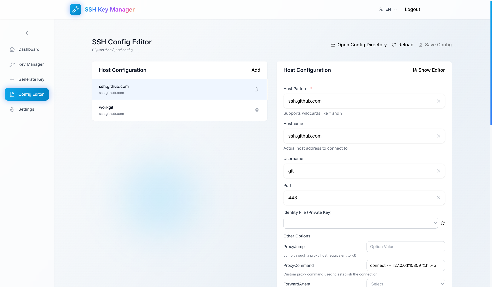
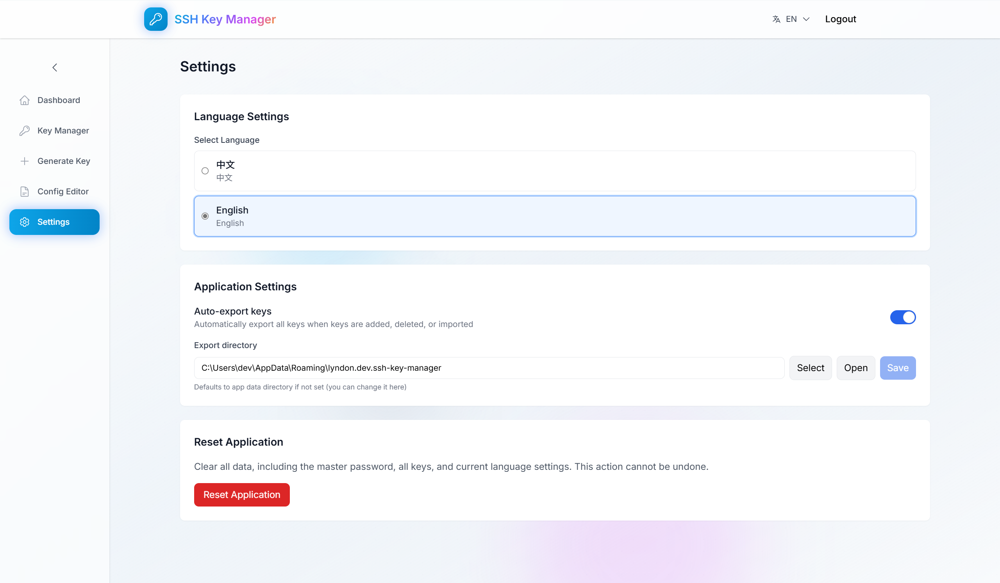

## SSH 密钥管理器

[English](./README.md) | 中文说明

### 概述
SSH 密钥管理器是一个基于 Tauri 2 与 Vue 3 的跨平台桌面应用，用于生成与管理 SSH 密钥，并以“表单 + 原始文本”两种方式维护 OpenSSH 配置。

### 功能特性
- **密钥生成**：支持 Ed25519、RSA(2048/4096)、ECDSA(256/384/521)，可选口令保护
- **密钥管理**：列表、搜索、名称/备注编辑、删除
- **导入/导出**：支持 JSON 导入/导出；按需导出选中密钥到 `~/.ssh`
- **SSH 配置编辑器**：主机列表、常用/高级选项、实时预览、原始编辑、保存到 `~/.ssh/config`
- **国际化**：英文/中文界面
- **技术栈**：Tauri 2、Vue 3、Pinia、Vue Router、Tailwind CSS、Heroicons、Vitest

### 环境准备
- Node.js 20+
- pnpm 8+
- Rust 稳定版工具链
- Tauri 各操作系统依赖（Windows 需 MSVC/WebView2，macOS 需 Xcode，Linux 需对应系统库）
  - 参考：[Tauri 依赖准备](https://tauri.app/v2/guides/getting-started/prerequisites)

### 快速开始
```bash
pnpm i

# 桌面（Tauri）开发
pnpm tauri dev

# Web 开发（可选）
pnpm dev
```

### 构建
- **桌面应用（Tauri）**
  ```bash
  pnpm tauri build
  ```
- **Web 构建**
  ```bash
  pnpm build
  pnpm preview # 可选
  ```

### 测试
```bash
pnpm test            # 监听模式
pnpm test:ui         # Vitest UI
pnpm test:run        # 单次运行
pnpm test:coverage   # 生成覆盖率报告 -> coverage/index.html
```

### 常用脚本（来自 package.json）
- `dev`：Vite 开发服务器
- `build`：类型检查 + Vite 构建
- `preview`：预览构建产物
- `tauri`：运行 Tauri CLI（dev/build）
- `test*`：Vitest 测试相关命令

### 目录结构
```text
src/                  # Vue 3 前端
  views/
    KeyGenerator.vue  # 生成密钥
    KeyManager.vue    # 管理/搜索/编辑/导入/导出密钥
    ConfigEditor.vue  # 编辑 OpenSSH 配置（表单 + 原始文本）
  stores/
    key.ts            # 密钥状态（Pinia）
  utils/
    sshOptions.ts     # 常见 SSH 选项与辅助函数
src-tauri/            # Tauri 2 后端、配置与图标
tests/                # Vitest 单元测试
```

### 界面截图
<p align="center">
  
</p>
<p align="center">
  
</p>
<p align="center">
  
</p>
<p align="center">
  
</p>
<p align="center">
  
</p>
<p align="center">
  
</p>

### 配置说明
- 开发服务器：`http://127.0.0.1:1420`（Vite），由 `vite.config.ts` 与 `src-tauri/tauri.conf.json` 指定
- 若设置 `TAURI_DEV_HOST`，HMR 使用 `ws://<host>:1421`（Windows 脚本已自动设置）

### 安全提示
- 密钥与配置仅在本地处理。将密钥导出到 `~/.ssh` 时请谨慎操作，建议为私钥设置口令并确保权限正确。

### 许可
本仓库当前尚未声明开源许可协议。


